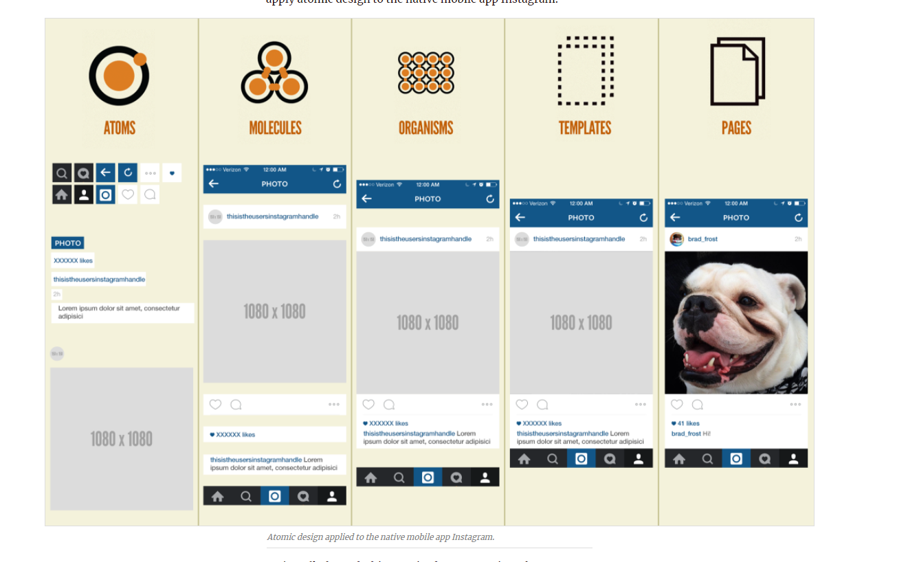

# Fast atomic design tutorial
### Atomic design is methodology for creating design systems. There are five distinct levels in atomic design:

- Atoms
- Molecules
- Organisms
- Templates
- Pages

# Important links:
 1. [Whats up?](https://bradfrost.com/blog/post/atomic-web-design)
 2. [Polish website](https://www.nafrontendzie.pl/metodyki-css-4-atomic-design)
 3. [The best learning link](https://atomicdesign.bradfrost.com/chapter-2/)
 3. [Examples](https://demo.patternlab.io/?p=templates-blog-index)
    

